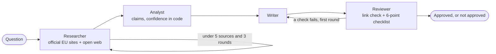

# Multi-Agent Research System (EU AI Act)

A LangGraph research pipeline that turns a question into a cited report. The model says which sources support each claim, and code computes the claim's confidence from those sources. A reviewer checks every report before it is approved, and the reviewer has its own test: errors planted in finished reports. Demoed on EU AI Act compliance; nothing in the architecture is specific to it.

Companion code for the Signal Syntax post [Building and Testing an AI Research Agent in Five Steps: An EU AI Act Example](https://signalsyntax.no/blog/eu-ai-act-research-agent/).

## Three versions

| Version | What it is |
|---|---|
| **V1** | One Claude call, no tools: what the model knows from training |
| **V2** | A fixed LangGraph workflow: researcher, analyst, writer, reviewer |
| **V3** | A supervisor splits the question, researchers search in parallel, no reviewer |



## Results

Four benchmark questions through all three versions, on Claude Sonnet 5 ([results/](results/)).

- **The deadline that moved.** Asked when the Annex III obligations apply, V1 answers 2 August 2026, the original date. V2 finds the Commission's announcement that the AI Omnibus entered into force on 27 July 2026, and answers 2 December 2027.
- **The reviewer, tested with planted errors** ([eval_reviewer.py](eval_reviewer.py)): 13 of 13 caught (4 invented links, 4 unsupported claims, 4 uncited claims, 1 changed date), and 1 false alarm in 4 clean reports, for $0.72. It checks the report against the extracted claims, so an error already inside a claim passes through.
- **V2 against V3**, for the four questions:

| | V2 | V3 |
|---|---|---|
| Time | 558 s | 381 s |
| Cost | $0.92 | $0.64 |
| Sources per report | 23 to 28 | 59 to 87 |
| Quality gate | Reviewer, 3 of 4 reports approved | None |

## Confidence

`authority × recency × corroboration`, capped at 1.0, computed in [src/confidence.py](src/confidence.py). Authority comes from a fixed list of source types in [src/sources.py](src/sources.py), from official EU text (1.0) down to news and blogs (0.15). Corroboration counts distinct domains. Labels: high from 0.7, medium from 0.4.

## Run it

Needs Python 3.14+, `uv`, an Anthropic API key and a Tavily API key.

```bash
uv sync
cp .env.example .env   # ANTHROPIC_API_KEY, TAVILY_API_KEY; LangSmith tracing is optional

uv run streamlit run app.py      # UI: benchmark results and live runs
uv run python v1_baseline.py     # V1 benchmark
uv run python run_benchmark.py   # V2 benchmark
uv run python v3_sketch.py       # V3 benchmark
uv run python eval_reviewer.py   # planted-error test of the V2 reviewer
uv run pytest                    # unit tests, no API calls
```

## Limitations

- Few sources have a publication date, so most count as undated.
- Source types come from a hand-made domain list; reputable sites that are not on it count as blogs.
- Four benchmark questions: the results show behavior, not statistics.
