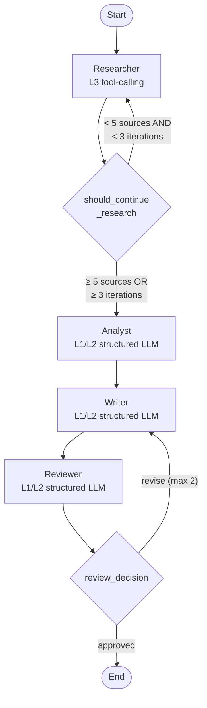

# Multi-Agent Research System (MAS)

A LangGraph-based research pipeline that takes a research question and produces a structured, cited report with confidence-weighted claims. Built as a portfolio project demonstrating the same system at three complexity levels.

## The Three Versions

| Version | Architecture | What it demonstrates |
|---------|-------------|---------------------|
| **V1** — Single API Call | One Claude call, no tools | Baseline: what a single LLM can and cannot do |
| **V2** — LangGraph Pipeline | StateGraph with 4 nodes + conditional loops | Production-grade: web search, source quality assessment, review loop |
| **V3** — Multi-Agent | Supervisor + parallel researchers | Demo: when to escalate complexity (and the cost of doing so) |

**The portfolio narrative:** "I built the same system at three complexity levels. Most clients need V2. Here's why, and here's how I know when to escalate to V3."

## Architecture (V2)



- **Researcher** — generates diverse search queries via LLM, executes Tavily web searches, classifies sources by domain (official EU, guidance, legal analysis, news)
- **Analyst** — extracts factual claims, computes confidence scores using source authority × recency × corroboration, detects contradictions
- **Writer** — produces a markdown report with citations and confidence levels; revises based on reviewer feedback
- **Reviewer** — 6-point quality gate checking citation coverage, hallucinations, contradiction disclosure, confidence assessment, executive summary accuracy, knowledge gaps

## Confidence-Weighted Synthesis

Every claim gets a confidence score: `authority × recency × corroboration`

**Source Authority Weights:**
| Source Type | Weight | Examples |
|------------|--------|----------|
| Official EU | 1.0 | EUR-Lex, AI Act text |
| EU Guidance | 0.85 | European Commission, AI Office |
| National Authority | 0.7 | Member-state regulators |
| Legal Analysis | 0.5 | Law firms, policy institutions |
| Industry | 0.3 | Compliance vendors, trade press |
| News/Blog | 0.15 | General news, blogs |

**Recency decay:** 0–90 days = 1.0×, 3–6 months = 0.8×, 6–12 months = 0.5×, 12+ months = 0.2×

**Corroboration:** single source = 1.0×, 2 sources agree = 1.2×, 3+ sources = 1.4× (capped)

## V1 vs V2: Why V2 Matters

The key demonstration: V1 treats the revoked US Executive Order 14110 as active policy. V2 catches this via web search.

| | V1 (Single Call) | V2 (Pipeline) |
|---|---|---|
| **EO 14110** | References as active policy | Correctly flags as **revoked** Jan 2025 |
| **Sources** | None (LLM knowledge only) | 12–15 verified web sources per question |
| **Citations** | Fabricated or vague | Real URLs with source type classification |
| **Confidence** | None | Scored per-claim with authority/recency weights |
| **Quality control** | None | Reviewer catches hallucinations and unsourced claims |

### Benchmark Comparison

| Question | V1 Duration | V2 Duration | V2 Sources | V2 Claims |
|----------|------------|------------|------------|-----------|
| Q1: High-risk AI hiring compliance | 23.5s | 53.5s | 15 | 10 |
| Q2: EU AI Act vs US federal AI policy | 27.3s | 45.1s | 12 | 8 |
| Q3: Conformity assessment procedures | 22.7s | 46.4s | 14 | 10 |

V2 takes ~2× longer but produces verified, cited, confidence-scored output instead of ungrounded LLM assertions.

## V3 Tradeoffs

V3 adds a supervisor that decomposes questions into subtopics and runs parallel researchers. More sources, but more cost and latency.

| | V2 | V3 | Tradeoff |
|---|---|---|---|
| **Q1 Sources** | 15 | 52 | 3.5× more coverage |
| **Q1 Duration** | 53.5s | 97.5s | 1.8× slower |
| **Q2 Sources** | 12 | 38 | 3.2× more coverage |
| **Q2 Duration** | 45.1s | 61.1s | 1.4× slower |
| **Q3 Sources** | 14 | 37 | 2.6× more coverage |
| **Q3 Duration** | 46.4s | 50.4s | 1.1× slower |
| **LLM Calls** | 4–6 | 3 + no review | No quality gate |
| **Reliability** | Review loop catches errors | No review loop | V2 more reliable |

**When to use V3:** Complex multi-faceted questions where source coverage matters more than reliability. For most use cases, V2 is the right choice.

## How It Works

A sample execution for *"What are the compliance requirements for deploying a high-risk AI hiring tool under the EU AI Act?"*:

1. **Researcher** generates 3 search queries (compliance requirements, enforcement actions, conformity assessment), runs Tavily searches, collects 15 deduplicated sources classified by authority type
2. **Analyst** extracts 10 claims with confidence scores (0.15–0.85), identifies 2 contradictions between sources on penalty amounts, flags 5 knowledge gaps
3. **Writer** produces a 694-word report with markdown citations, confidence labels, and a knowledge gaps section
4. **Reviewer** runs 6-point checklist — approves on round 1 (or sends back for revision if unsourced claims are found)

## Setup

```bash
# Prerequisites: Python 3.14+, uv

# Install dependencies
uv sync

# Configure API keys
cp .env.example .env
# Edit .env with your keys:
#   ANTHROPIC_API_KEY=sk-ant-...
#   TAVILY_API_KEY=tvly-...
#   LANGCHAIN_API_KEY=lsv2_...  (optional, for LangSmith tracing)
#   LANGCHAIN_ENDPOINT=https://eu.api.smith.langchain.com  (if EU instance)
#   LANGCHAIN_TRACING_V2=true
#   LANGCHAIN_PROJECT=ProjectA2
```

## Usage

```bash
# Streamlit UI (V2 + V3 benchmarks and live queries)
uv run streamlit run app.py

# Run V1 baseline
uv run python v1_baseline.py

# Run V2 benchmarks
uv run python run_benchmark.py

# Run V3 benchmarks
uv run python v3_sketch.py
```

## Tech Stack

- **LangGraph** — StateGraph with conditional edges for research and review loops
- **LangChain + ChatAnthropic** — Claude Sonnet for all LLM calls (cost/quality balance)
- **Tavily** — Web search API (advanced depth, 5 results per query)
- **Pydantic** — Structured data models for sources, claims, contradictions
- **Streamlit** — UI with real-time pipeline status and benchmark result explorer
- **LangSmith** — Tracing and observability (optional)

## Design Decisions

- **Claude Sonnet over Opus** — sufficient quality for structured extraction at ~5× lower cost
- **Deterministic edges** — research and review loops use simple threshold checks, not LLM decisions, for reliability
- **Source authority hierarchy** — confidence scoring prioritizes primary legal text over commentary, with recency decay
- **Domain-specific alerts** — hardcoded checks for known stale information (EO 14110 revocation, Digital Omnibus status, GPAI/high-risk timelines)
- **No review loop in V3** — intentional, to demonstrate the reliability tradeoff vs V2
