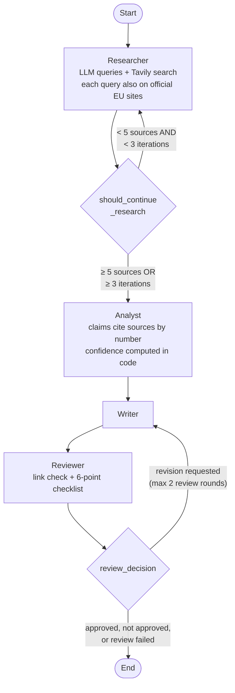

# Multi-Agent Research System (MAS)

A LangGraph research pipeline that turns a research question into a cited report. Every claim carries a confidence score computed from its sources, and a reviewer checks the report against the extracted claims before it is approved. Demoed on EU AI Act compliance; nothing in the architecture is specific to it. The same system is built at three levels of complexity.

## The Three Versions

| Version | Architecture | What it demonstrates |
|---------|-------------|---------------------|
| **V1**: Single API call | One Claude call, no tools | Baseline: what a model knows from training alone |
| **V2**: LangGraph pipeline | StateGraph with 4 nodes, a research loop and a review loop | Web search, source authority, confidence computed in code, a reviewer that can reject |
| **V3**: Multi-agent sketch | Supervisor + parallel researchers, no review | When to escalate complexity, and what the quality gate is worth |

**The portfolio narrative:** "I built the same system at three complexity levels. Most clients need V2. Here's why, and here's how I know when to escalate to V3."

## September 2026 update

The March 2026 version was audited and rebuilt. What changed, and why:

- **No facts hardcoded in prompts.** The Analyst prompt stated that the EU's Digital Omnibus was "proposed, not adopted" and that high-risk obligations apply from 2 August 2026. Both became false when Regulation (EU) 2026/1744 entered into force on 27 July 2026, so the guard against stale information was injecting stale information. Prompts now carry today's date, and current facts have to come from sources.
- **Confidence is computed in code** ([src/confidence.py](src/confidence.py)). Before, the formula was text in the prompt and the model wrote the number: none of the saved sources had a publication date, yet recency was "applied", and 12 claims scored above the maximum the formula allows. Now the Analyst only says which sources support a claim, by number, and the score follows from those sources.
- **Sources are classified deterministically** ([src/sources.py](src/sources.py)) with a wider domain list. Unknown hosts used to count as news, and US `.gov` sites were labelled EU guidance.
- **Official sources are searched explicitly.** Every query also runs restricted to `europa.eu`. Open web search mostly returned blogs and vendor pages, so current facts from official sources were missing and scored low.
- **The reviewer fails closed.** It used to approve the report when its own output could not be parsed. It now adds a deterministic check that every link points to a gathered source, and a report that still fails after the last round ends as "not approved" instead of being approved anyway.
- **Structured outputs** (`messages.parse` with Pydantic models) replace hand-written JSON parsing.
- **Claude Sonnet 5**, called through the Anthropic SDK (`claude-sonnet-4-20250514` is deprecated). The LangChain wrappers are gone; LangGraph remains the orchestrator.
- **One question set** for V1, V2 and V3 ([src/benchmarks.py](src/benchmarks.py)), with a new Q4 on a date the Omnibus changed.

## Architecture (V2)



- **Researcher**: writes search queries with Claude, runs each through Tavily twice, once restricted to `europa.eu` and once on the open web, classifies each source by domain, and reads a publication date from the search result or the URL when there is one.
- **Analyst**: extracts claims, contradictions and open issues as a structured output. Each claim cites source numbers; claims without a valid source are dropped. Confidence is computed from the cited sources.
- **Writer**: writes a markdown report with a citation for every statement and the confidence label of each claim; on revision, it works from the reviewer's instructions.
- **Reviewer**: checks that every link is a gathered source, then runs a six-point checklist against the extracted claims: citation coverage, hallucinations (including changed numbers and dates), contradiction disclosure, confidence labels, executive summary accuracy, knowledge gaps. It approves only when every check passes.

## Confidence

Every claim gets `authority × recency × corroboration`, capped at 1.0, computed in [src/confidence.py](src/confidence.py):

- **Authority and recency** come from the strongest single source supporting the claim.
- **Corroboration** counts distinct domains, so three pages from one site are one source.

| Source type | Authority | Examples |
|------------|--------|----------|
| Official EU | 1.0 | EUR-Lex, Official Journal |
| EU guidance | 0.85 | Commission, AI Office, Council, Parliament |
| National authority | 0.7 | Member-state and Norwegian regulators, US federal agencies |
| Legal analysis | 0.5 | Law firms, policy institutes |
| Industry | 0.3 | Compliance vendors, consultancies |
| News/Blog | 0.15 | Everything else |

**Recency:** 0–90 days 1.0×, 3–6 months 0.8×, 6–12 months 0.5×, over 12 months 0.2×. A source without a publication date gets 0.8×: it may be current, but nothing shows it.

**Corroboration:** one domain 1.0×, two 1.2×, three or more 1.4×.

**Labels:** high from 0.7, medium from 0.4, low below.

## Results (September 2026, Claude Sonnet 5)

Four benchmark questions through all three versions, run on 27 September 2026 ([results/](results/)).

| Question | V1 | V2 | V3 |
|---|---|---|---|
| Q1: High-risk AI hiring tool compliance | 40s, $0.04 | 143s, $0.25, 2 review rounds, not approved | 115s, $0.19 |
| Q2: EU AI Act vs current US federal policy | 42s, $0.04 | 182s, $0.30, 2 review rounds, approved | 87s, $0.16 |
| Q3: Conformity assessment and notified bodies | 37s, $0.03 | 147s, $0.25, 2 review rounds, approved | 88s, $0.15 |
| Q4: When Annex III obligations apply | 24s, $0.02 | 85s, $0.13, 1 review round, approved | 92s, $0.14 |

| Question | V2 sources (official/EU) | V2 claims (high confidence) | V3 sources (official/EU) | V3 claims (high confidence) |
|---|---|---|---|---|
| Q1 | 27 (14) | 22 (7) | 84 (44) | 18 (15) |
| Q2 | 27 (12) | 24 (4) | 87 (41) | 25 (15) |
| Q3 | 28 (14) | 18 (3) | 80 (40) | 26 (8) |
| Q4 | 23 (10) | 11 (5) | 59 (30) | 12 (9) |

### V1 vs V2: why V2 matters

**Q4 is the question whose answer changed in 2026.** V1, a single call to the same model, says the Annex III obligations apply from 2 August 2026 and hedges about "ongoing regulatory discussion about potential delays". V2 and V3 find the Commission's announcement that the AI Omnibus entered into force on 27 July 2026, the AI Act Service Desk FAQ and the consolidated text on EUR-Lex, and give **2 December 2027**, with a note that many compliance sites still show the old date. A model's knowledge has a date; the pipeline reads today's sources and shows where each statement came from.

The March 2026 example no longer separates them: V1 treated the revoked US Executive Order 14110 as current policy. With Claude Sonnet 5, V1 knows it was revoked in January 2025.

V2 approved 3 of the 4 reports. Q1 ended not approved after two rounds: the reviewer found penalty figures stated more strongly than the extracted claims support, and an open issue missing from the knowledge gaps.

## Does the reviewer catch errors?

The reviewer is the pipeline's quality gate, so it has its own test ([eval_reviewer.py](eval_reviewer.py)). One error of a known type is planted in copies of finished V2 reports, and the reviewer runs on every copy and on the unmodified report.

| Planted error | Caught | Checks that flagged it |
|---|---|---|
| A sentence citing a URL that is not among the gathered sources | 4 of 4 | link check 4, hallucination 4, confidence 4 |
| A plausible obligation, cited to a real source, that no claim supports | 4 of 4 | hallucination 4 |
| An extracted claim restated without a citation | 4 of 4 | citation coverage 3, confidence 1 |
| A date in Key Findings moved by one year | 1 of 1 | hallucination 1 (only one report had a date in that format) |
| **Unmodified report** (false alarm) | 1 of 4 rejected | confidence labels |

13 of 13 planted errors caught, one false alarm in four clean reports, for $0.72 in 17 reviewer calls. The reports came from a V2 run made before the official-site search covered every query ([results/v2_20260927_234643_first_query_only.json](results/v2_20260927_234643_first_query_only.json)); the reviewer is the same.

**What it cannot catch:** an error already inside an extracted claim, because it checks the report against the claims. In the Q4 report, the Analyst combined the European Parliament's summary, which says high-risk obligations apply "36 months after the entry into force" (that is the date for AI in regulated products, Annex I), with the Annex III date, 2 August 2026, which is 24 months after. The claim is wrong, the report repeats it, and the reviewer approves. Checking each claim against the text of its sources is the next step.

## V3 trade-offs

| | V2 | V3 |
|---|---|---|
| Time for the 4 questions | 558s | 381s |
| Cost for the 4 questions | $0.92 | $0.64 |
| Sources per report | 23–28 (10–14 official/EU) | 59–87 (30–44 official/EU) |
| High-confidence claims per report | 3–7 | 8–15 |
| Quality gate | Reviewer: 3 of 4 approved, 13 of 13 planted errors caught | None |

With parallel search and no review loop, V3 is now faster, cheaper and better sourced than V2. (In March 2026 it was slower.) What it gives up is the check: nothing stops a report with a fabricated link or an unsupported claim from going out.

**When to use V3:** broad questions where coverage matters more than a quality gate. For anything a person will rely on without re-checking, use V2, or add V2's reviewer to V3's parallel research, which is the obvious next version.

## Setup

```bash
# Prerequisites: Python 3.14+, uv
uv sync

# Configure API keys
cp .env.example .env
# Edit .env with your keys:
#   ANTHROPIC_API_KEY=sk-ant-...
#   TAVILY_API_KEY=tvly-...
#   LANGCHAIN_API_KEY=lsv2_...  (optional, for LangSmith tracing)
#   LANGCHAIN_ENDPOINT=https://eu.api.smith.langchain.com  (if EU instance)
#   LANGCHAIN_TRACING_V2=true
```

## Usage

```bash
# Streamlit UI: V1, V2 and V3 benchmark results, and live runs
uv run streamlit run app.py

# Benchmarks (each saves to results/)
uv run python v1_baseline.py
uv run python run_benchmark.py      # V2
uv run python v3_sketch.py

# Planted-error test of the V2 reviewer (uses the latest results/v2_*.json)
uv run python eval_reviewer.py

# Unit tests (no API calls)
uv run pytest
```

## Tech Stack

- **LangGraph**: StateGraph with conditional edges for the research and review loops
- **Anthropic SDK**: Claude Sonnet 5 for every LLM call, with structured outputs
- **Tavily**: web search (advanced depth, 5 results per query)
- **Pydantic**: sources, claims, confidence, review checklist
- **Streamlit**: UI with pipeline status and a benchmark explorer
- **LangSmith**: tracing (optional)

## Design Decisions

- **Claude Sonnet over Opus**: enough quality for extraction and review at a lower cost. Effort is set per node: low for search queries, medium for extraction and writing, medium for review.
- **Deterministic edges**: the research and review loops use threshold checks, not LLM decisions.
- **The number is never the LLM's**: the model says which sources support a claim; code computes the confidence.
- **Fail closed**: a report is approved only when every check passes, including when the review itself fails.
- **No review loop in V3**, on purpose, to show what the quality gate is worth.

## Limitations

- **Few dated sources**: Tavily returns publication dates only for news searches, and most pages have no date in the URL, so most sources count as undated.
- **Domain lists are hand-made**: sources from unknown domains count as news, which understates reputable but unlisted sources.
- **The reviewer is an LLM, and it checks the report against the claims**: the planted-error test above shows what it catches; errors already inside a claim pass through.
- **Small benchmark**: four questions. The results show behaviour, not statistics.
